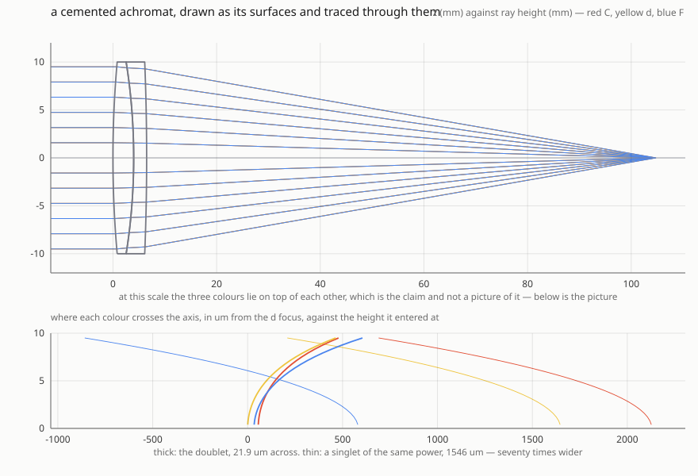
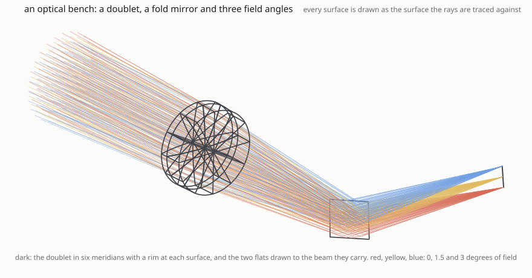
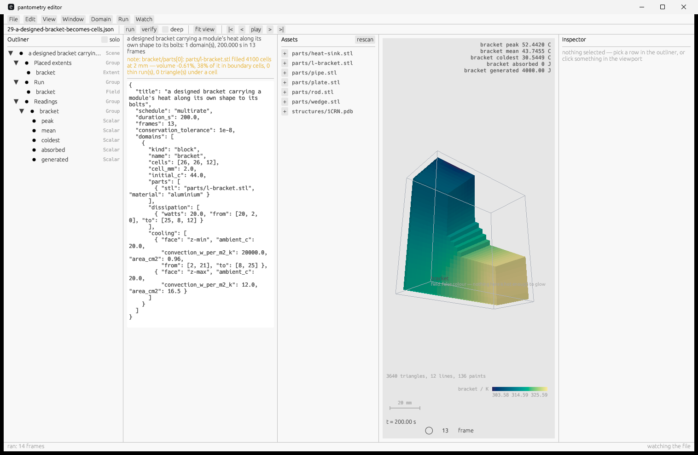
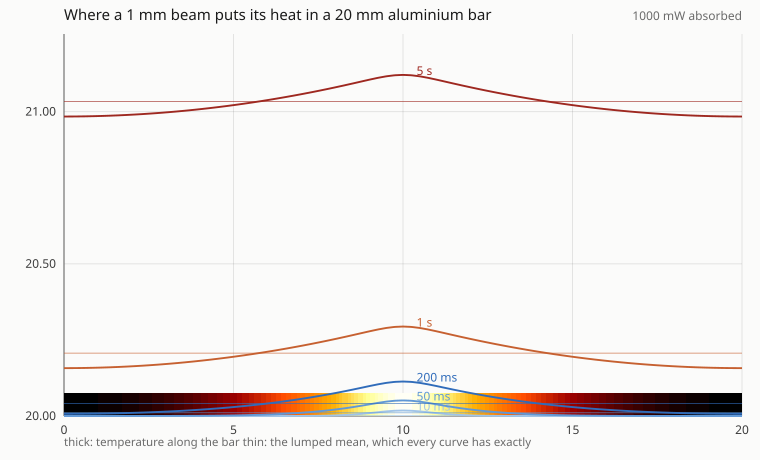

# pantometry

[](https://github.com/YounghyeonPark/pantometry/actions/workflows/ci.yml)
[](https://crates.io/crates/pantometry)
[](https://docs.rs/pantometry)

Physics for simulated worlds — a kernel that knows nothing about any particular physics, and
thirteen domains built on it that do: **light, heat, motion, sound, electricity, electromagnetic
fields, elastic deformation, incompressible flow, flow through a packed bed, matter one atom at a
time, a quantum wavefunction in a well, the motions a measured protein has, and a drug
distributing through a body.** Two layers above them place a simulation in the world and draw it,
and neither knows a domain either.

Dimensions live in the type system, so `Length + Time` does not compile. Conservation is audited
rather than assumed, and a `Violation` names what went missing and where. Every result is
reproducible bit for bit — across platforms, across optimisation levels, in WebAssembly, and under
sixteen threads as readily as one.

Every claim is checked against a **closed form** or an independent computation, never against
another implementation that might be wrong in the same direction. Where no closed form exists,
[EVIDENCE.md](EVIDENCE.md) says so.



*`cargo run --release --example lens_spots -- lens.svg`. The three SVGs here are an example's
output and every example checks itself against a closed form. The three screenshots are the
figures CI cannot take — they need a GPU, and the editor's needs a display — so each carries a
machine-readable record of what it is a picture *of*, and the thing that writes that record fails
when the picture goes stale.*



*`cargo run --release --example optical_bench bench.svg`, or `bench.html` for the same scene
rotatable in a browser, or `bench.gltf` for somebody else's renderer. **Every surface in it is
drawn as the surface the rays are traced against**, checked point by point against the same
intersection the trace uses — and the two flats are drawn to the footprint of the beam, because a
prescription gives a fold mirror no size at all.*


*The same run through the viewer, which shades it: `pantometry view bench.json`. The glass is a
**solid** here rather than an outline — 6 404 vertices and 12 288 triangles, every edge of each
element shared by exactly two faces and every vertex still a point a ray lands on. A line behind it
is hidden by it, which is a thing measured rather than looked at.*


*A different domain through the same viewer: `cargo run --release --example ligand_binding
closing.json`, then `pantometry view closing.json`, where space plays it. The enzyme is walking
its **own softest mode** — the model is shown only the open structure, and that one direction
scores `0.799` against the motion the enzyme is observed to perform, where a direction that knew
nothing would score `0.039` in 642 dimensions. What the picture adds to that number is the thing a
line cannot: the lids close **over** the molecule, and you can see them do it.*

*The backbone is a tube of 7 680 triangles swept along 640 spline samples that pass through every
one of the 214 alpha carbons. Its radius is not a taste — the chain turns through six places where
the radius of curvature is about 0.9 Å, and a tube wider than that passes through its own axis and
renders as a bead, so the run measures the ratio and refuses above one. It is also checked closed,
right-side-out, and clear of the places the chain folds back past itself. The molecule is
**C20 N10 O22 P5** at Bondi radii, and that formula is the check: AP5A is `C20H29N10O22P5`, a
structure at this resolution has no hydrogens, and counted before the reader's
alternate-location rule the same records come to `O28 P6` — sixty-four atoms, seven of them one
atom modelled twice.*

## Install

```sh
cargo add pantometry     # one dependency, all nineteen published crates
pip install pantometry   # or from Python — see bindings/python
```

```toml
pantometry = "0.21"
```

## Run

In a clone of this repository:

```sh
cargo run --release --example melting            # a crystal melting, read off its own structure
cargo run --release --example beam_hot_spot      # a laser on a mirror, and the hot spot a lumped
                                                 # model misses
cargo test --workspace                           # the suite, all against closed forms
```

Most examples take an output path and draw the result — an SVG, or a page you open:

```sh
cargo run --release --example lens_spots -- lens.svg
```

Everything a person runs is one binary, in [`app/`](app/README.md) — the CLI, the viewer, the
editor and the GPU accelerator:

```sh
cd app
cargo run --release -- run    scene.json out.html   # run it and write an asset, by extension
cargo run --release -- verify scene.json --deep     # margins, determinism, sweeps, geometry
cargo run --release -- edit   scene.json            # the editor: check as you type, run, verify
```

`pantometry edit` with no file opens on a start screen: a new project, a scene to open, or one you
had open before.



*`pantometry edit 29-a-designed-bracket-becomes-cells.json --run`. An L-bracket designed as an STL,
filled into 4 100 cells at 2 mm and cooling to still air. The scene is the text on the left and the
picture is what running it produced — the readings, the colour bar and the frame transport are the
run's, and the note in orange is the mesher saying what it did.*



*A laser on a mirror. The thin line is the lumped mean, which every curve has exactly — and the
thick ones are what a lumped model cannot tell you: the peak is well above it.*

## Where everything else is

| read | for |
| --- | --- |
| [AGENTS.md](AGENTS.md) | the whole API on one page. `cargo run --example agents_quickstart` is a runnable version, including a deliberate 10% energy leak so you can see what the audit says |
| [ARCHITECTURE.md](ARCHITECTURE.md) | the map: three layers, the nineteen crates, what is built, what is missing, and what is deliberately not here |
| [EVIDENCE.md](EVIDENCE.md) | how the claims are checked, and what checking them found — including two real defects the conservation audit reported as clean |
| [EXAMPLES.md](EXAMPLES.md) | every example and what it demonstrates |
| [app/README.md](app/README.md) | the binary: CLI, viewer, editor, accelerator |
| [CONTRIBUTING.md](CONTRIBUTING.md) | the conventions, and everything CI runs in the order it runs it |
| [CHANGELOG.md](CHANGELOG.md) | what was found, as well as what was added |
| [CLAUDE.md](CLAUDE.md) | working *on* pantometry rather than with it |

`pantometry-world` was the **first** consumer — the editor has been the second since it needed
`World::advance` made public, and the Python bindings are a third — and its first job was not to be
a good application but to use the SDK the way a stranger would.
[`app/pantometry-world/FRICTION.md`](app/pantometry-world/FRICTION.md) is what it came back with:
**forty-nine findings, forty-three fixed and six argued down in writing** — forty-eight from
building it and one from an example, which says so. Not one of the library's own tests could have
found any of them: a test is written by somebody who already knows the shape.

## Citation

If this software contributes to work you publish, please cite it. `CITATION.cff` is beside this file
and GitHub renders it as a **Cite this repository** button; the same content as BibTeX:

```bibtex
@software{park_pantometry,
  author  = {Park, Younghyeon},
  title   = {pantometry: physics for simulated worlds, checked against closed forms},
  version = {0.21.0},
  year    = {2026},
  doi     = {10.5281/zenodo.22760497},
  url     = {https://doi.org/10.5281/zenodo.22024817},
  note    = {ORCID: 0000-0002-4733-5049. The `doi` is 0.21.0's; the `url` is the concept DOI,
             which always resolves to the newest version. Both move with a release --
             this block named 0.16.0 through the whole of 0.17.0, and its `version`
             was left at 0.19.0 through the 0.20.0 bump because no list covered it},
  license = {MIT OR Apache-2.0}
}
```

### Co-authorship is not requested, and here is why that is the honest answer

It would be easy to write "please add me as an author" here, and it would be wrong on three counts.

It **could not be required**. `MIT OR Apache-2.0` is already granted irrevocably, and a licence with an
authorship condition attached would no longer be an open-source licence under the OSI definition — it
would impose a restriction the two licences people already rely on do not have.

It is **contrary to how authorship works**. ICMJE and COPE both rest authorship on an intellectual
contribution to the *specific work* being published. Supplying a tool is not that, however much work
the tool was. Authorship asked for on those grounds is what the literature calls gift or honorary
authorship, and an editor who saw it as a condition of use would strike it.

And it would **cost the thing it was reaching for**. A tool with a tax on it loses users, and users are
where citations come from.

### What is invited instead

If you build something with this, I would like to hear about it — and if there is a question the
library cannot answer yet, open an issue. Where that turns into real involvement in your work — a
domain built for your problem, an analysis argued through together — a joint contribution is earned in
the ordinary way, and I am glad to do it. That is an invitation and not a condition.

An acknowledgement, if the work does not warrant more, is always welcome and never expected.

## Licence

Dual-licensed under either [MIT](LICENSE-MIT) or [Apache-2.0](LICENSE-APACHE) at your
option — the Rust ecosystem's convention, and not indecision. Each covers a gap the other
has. Apache-2.0 carries an explicit patent grant and MIT does not, which is the first thing a
corporate legal review asks about. MIT is compatible with GPLv2 and Apache-2.0 is not, which
matters here because the scientific-computing world has plenty of GPLv2 code. Offering both
lets a consumer take whichever they need, so `OR` is strictly *less* restrictive than either
alone.

Unless you explicitly state otherwise, any contribution intentionally submitted for inclusion
in the work by you, as defined in the Apache-2.0 licence, shall be dual-licensed as above,
without any additional terms or conditions.

Every dependency is permissive too, and that is checked rather than remembered: `deny.toml`
holds an allow-list and CI fails on anything outside it. Twelve external crates at the time of
writing, of which three reach a *published* artifact — `glam`, `serde` and `serde_core`, all under
the same `MIT OR Apache-2.0`. `serde_json` and its three transitive crates are a **dev**-dependency
of four of the published crates, so they reach no artifact either. The rest are compile-time or test-only.

Two crates were added in 0.9.0 and the count did not move. `pantometry-view` has **no external**
dependency at all — `pantometry-scene`, and two of this workspace's own crates to develop against: SVG and HTML are text, so a renderer is a `format!` and a file
write, and the alternative would have put a plotting stack into the tree of every consumer who
wanted a picture.
